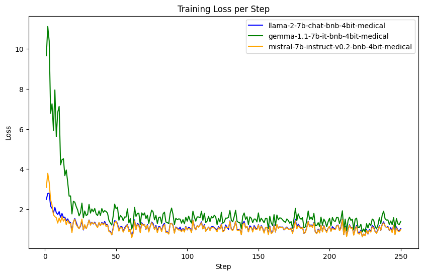

# LLM-7B-Medical-Finetuning

This repository contains all the code necessary to finetune(PEFT using LoRA/QLoRa) the most popular 7B parameters instruct LLMs(Mistral, Llama, Gemma), specifically on medical data by utilizing. The code repository is based on two parts:
- preparing the instruct medical datasets
- finetuning the instruct LLMs on the prepared datasets

## Preparing the datasets

For this showcase project, two datasets are used:
- Medical meadow wikidoc (https://huggingface.co/datasets/medalpaca/medical_meadow_wikidoc/blob/main/README.md)
- Medquad (https://www.kaggle.com/datasets/jpmiller/layoutlm)

### Medical meadow wikidoc

The Medical Meadow Wikidoc dataset comprises question-answer pairs sourced from WikiDoc, an online platform where medical professionals collaboratively contribute and share contemporary medical knowledge. WikiDoc features two primary sections: the "Living Textbook" and "Patient Information". The "Living Textbook" encompasses chapters across various medical specialties, from which we extracted content. Utilizing GTP-3.5-Turbo, the paragraph headings are transformed into questions and utilized the respective paragraphs as answers. Notably, the structure of "Patient Information" is distinct; each section's subheading already serves as a question, eliminating the necessity for rephrasing.

### Medquad

MedQuAD is a comprehensive collection consisting of 47,457 medical question-answer pairs compiled from 12 authoritative sources within the National Institutes of Health (NIH), including domains like cancer.gov, niddk.nih.gov, GARD, and MedlinePlus Health Topics. These question-answer pairs span 37 distinct question types, covering a wide spectrum of medical subjects, including diseases, drugs, and medical procedures. The dataset features additional annotations provided in XML files, facilitating various Information Retrieval (IR) and Natural Language Processing (NLP) tasks. These annotations encompass crucial information such as question type, question focus, synonyms, Unique Identifier (CUI) from the Unified Medical Language System (UMLS), and Semantic Type. Moreover, the dataset includes categorization of question focuses into three main categories: Disease, Drug, or Other, with the exception of collections from MedlinePlus, which exclusively focus on diseases.

For our experiments there are 12 different versions of the datasets, available as Hugging Face datasets:
- medical_gemma_instruct_dataset (https://huggingface.co/datasets/Shekswess/medical_gemma_instruct_dataset)
- medical_gemma_instruct_dataset_short (https://huggingface.co/datasets/Shekswess/medical_gemma_instruct_dataset_short)
- medical_llama_instruct_dataset (https://huggingface.co/datasets/Shekswess/medical_llama_instruct_dataset)
- medical_llama_instruct_dataset_short (https://huggingface.co/datasets/Shekswess/medical_llama_instruct_dataset_short)
- medical_mistral_instruct_dataset (https://huggingface.co/datasets/Shekswess/medical_mistral_instruct_dataset)
- medical_mistral_instruct_dataset_short (https://huggingface.co/datasets/Shekswess/medical_mistral_instruct_dataset_short)
- gemma_medquad_instruct_dataset (https://huggingface.co/datasets/Shekswess/gemma_medquad_instruct_dataset)
- llama_medquad_instruct_dataset (https://huggingface.co/datasets/Shekswess/llama_medquad_instruct_dataset)
- mistral_medquad_instruct_dataset (https://huggingface.co/datasets/Shekswess/mistral_medquad_instruct_dataset)
- gemma_medical_meadow_wikidoc_instruct_dataset (https://huggingface.co/datasets/Shekswess/gemma_medical_meadow_wikidoc_instruct_dataset)
- llama_medical_meadow_wikidoc_instruct_dataset (https://huggingface.co/datasets/Shekswess/llama_medical_meadow_wikidoc_instruct_dataset)
- mistral_medical_meadow_wikidoc_instruct_dataset (https://huggingface.co/datasets/Shekswess/mistral_medical_meadow_wikidoc_instruct_dataset)


## Finetuning the LLMs

The fine-tuning of the LLMs is based around PEFT(Parameter Efficient FineTuning - Supervised Tuning) using LoRA/QLoRA. Because the resources on Google Colab are limited(T4 GPU), sparing resources is crucial. That's why 4 bit quantization models are used, which are available on Hugging Face by using the models available by unsloth(https://github.com/unslothai/unsloth). Also most of the code is based on the library provided by unsloth.
For the finetuning, the following models are used:
- gemma-1.1-7b-it-bnb-4bit
- llama-2-7b-chat-bnb-4bit
- mistral-7b-instruct-v0.2-bnb-4bit

Much more details about the fine-tuning process can be found in the notebooks in the `src/finetuning_notebooks` folder.

Models trained using this codebase are available on Hugging Face:
- Gemma: Shekswess/gemma-1.1-7b-it-bnb-4bit-medical(https://huggingface.co/Shekswess/gemma-1.1-7b-it-bnb-4bit-medical)
- Llama: Shekswess/llama-2-7b-chat-bnb-4bit-medical(https://huggingface.co/Shekswess/llama-2-7b-chat-bnb-4bit-medical)
- Mistral: Shekswess/mistral-7b-instruct-v0.2-bnb-4bit-medical(https://huggingface.co/Shekswess/mistral-7b-instruct-v0.2-bnb-4bit-medical)

### Training Loss on all models


DISCLAIMER: The models are trained on a small dataset (only 2000 entries).

## Repository structure
```
.
├── .vscode                                                 # VSCode settings
│   └── settings.json                                       # Settings for the formatting of the code
├── artifacts                                               # Artifacts generated during the training of the models
│   ├── all_models.png                                      # Training loss of all models
│   ├── gemma_loss.csv                                      # Training loss of the Gemma model per step
│   ├── gemma_loss.png                                      # Training loss of the Gemma model
│   ├── llama_loss.csv                                      # Training loss of the Llama model per step
│   ├── llama_loss.png                                      # Training loss of the Llama model
│   ├── mistral_loss.csv                                    # Training loss of the Mistral model per step
│   ├── mistral_loss.png                                    # Training loss of the Mistral model
│   ├── trainer_stats_gemma.json                            # Trainer stats of the Gemma model
│   ├── trainer_stats_llama.json                            # Trainer stats of the Llama model
│   └── trainer_stats_mistral.json                          # Trainer stats of the Mistral model
├── data                                                    # Datasets used in the project
│   ├── processed_datasets                                  # Processed datasets
│   │   ├── medical_gemma_instruct_dataset                  # Processed dataset for the Gemma
│   │   ├── medical_gemma_instruct_dataset_short            # Processed dataset for the Gemma with a smaller dataset size
│   │   ├── medical_llama_instruct_dataset                  # Processed dataset for the Llama
│   │   ├── medical_llama_instruct_dataset_short            # Processed dataset for the Llama with a smaller dataset size
│   │   ├── medical_mistral_instruct_dataset                # Processed dataset for the Mistral
│   │   └── medical_mistral_instruct_dataset_short          # Processed dataset for the Mistral with a smaller dataset size
│   └── raw_data                                            # Raw datasets
│       ├── medical_meadow_wikidoc.csv                      # Medical Meadow Wikidoc dataset
│       └── medquad.csv                                     # Medquad dataset
├── src                                                     # Source code
│   ├── data_processing                                     # Data processing scripts
│   │   ├── create_process_datasets.py                      # Script to create processed datasets
│   │   ├── instruct_datasets.py                            # Defining the processing of the datasets to be in the instruct format
│   │   └── requirements.txt                                # Requirements for the data processing scripts
│   └── finetuning_notebooks                                # Notebooks for the fine-tuning of the LLMs
│       ├── gemma_1_1_7b_it_medical.ipynb                   # Notebook for the fine-tuning of the Gemma LLM
│       ├── llama_2_7b_chat_medical.ipynb                   # Notebook for the fine-tuning of the Llama LLM
│       └── mistral_7b_instruct_v02_medical.ipynb           # Notebook for the fine-tuning of the Mistral LLM
├── .gitignore                                              # Git ignore file
└── README.md                                               # README file (this file)
```